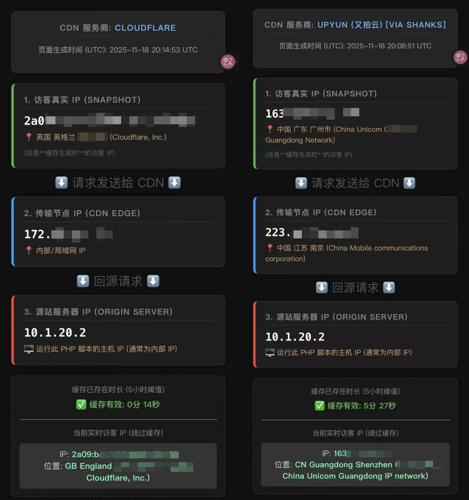

# CDN Path Tracer

> **本工具完全由 Ai 编写，存放在开源仓库仅为个人自用备份。该工具用来帮我确认我设置的 不同的国家地区使用不同的 CDN 服务 是否生效。**

本工具用于实时诊断网站在 CDN 加速环境下的网络链路、缓存状态和 IP 归属信息。它通过后端代理获取实时访客 IP，并能识别多种 CDN 服务商（包括又拍云）。

目前已测试以下CDN

* 阿里云
* 又拍云
* Cloudflare
* AWS CloudFront

## 功能


| 功能模块 | 描述                                                                                         |
| -------- | -------------------------------------------------------------------------------------------- |
| IP 显示  | 明确区分并显示访客、CDN 边缘节点和源站服务器（为服务器内网，也可设置不显示）的三重 IP 地址。 |
| 缓存监控 | 计算页面生成时间与当前时间的差值，实时显示缓存已存在时长。                                   |
| 缓存状态 | 当缓存时长超过 5 小时阈值时，前端将显示醒目的红色警告。                                      |
| CDN 识别 | 支持识别 Cloudflare、阿里云、AWS CloudFront 等，并针对 又拍云 进行了 Headers 优化。          |
| 实时 IP  | 绕过 CDN 缓存，通过安全代理获取访客的实时 IP 和地理位置。                                    |



## 配置指南

本项目需要两个 PHP 文件配合工作，两者都必须上传到您网站源站的同一目录下。访问 cdn.php 即可。

可以根据实际需要来设置 CDN 缓存 cdn.php。 通过设置与其他页面的相同缓存时间来确认 CDN 接入，IP 链条验证，实时缓存诊断， 在多品牌 CDN 混合使用中可以有效定位是否生效。

### 1.外部服务

需要前往 [ipinfo.io](https://ipinfo.io) 注册生成 Token，该 Token 存储在后端的 ip_proxy.php 文件中，不会暴露给前端。

### 2. 文件结构

```
/your-website-root/
└── [your-accelerated-path]/
    ├── cnd.php    <-- 主显示页面
    └── ip_proxy.php <-- 安全代理文件 (包含 Token)

```

### 3. 关键配置 (必须修改)

需要在 **ip_proxy.php** 以及 cdn.php 文件中替换两个占位符：


| 文件         | 变量            | 占位符内容      | 您的实际内容                        |
| ------------ | --------------- | --------------- | ----------------------------------- |
| ip_proxy.php | $ALLOWED_DOMAIN | your-domain.com | 您的网站域名                        |
| ip_proxy.php | $IPINFO_TOKEN   | 1111111111      | 您的 ipinfo.io 令牌                 |
| cdn.php      | $SHOW_SERVER_IP | true            | 设置为 false 隐藏源站服务器 IP 卡片 |

### 4. 运行要求

- PHP 版本： PHP 5.6 或更高版本。
- 环境要求： 需要允许 PHP 脚本发起外部网络请求 (allow_url_fopen 或 cURL - 本项目使用 file_get_contents，通常默认开启)。
- 请在 CDN 排除缓存 ip_proxy.php 文件

## © 版权与许可 (License)

本项目代码基于 MIT 许可协议开源。

**Designed by AustenYE** (Code assisted by Gemini)
